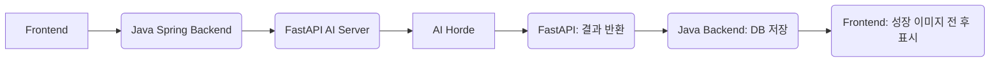

# 🚀 엄정민 님의 핵심 기여 (Core Contribution)

> **역할:** 팀원 / 풀스택 개발자 / AI 이미지 변형 전문
>
> **담당:** **AI 성장형 캐릭터 시스템** 개발 (이미지 변형 AI 생성), **통합 커뮤니티 기능** 구현, **DB 테이블 정의서** 작성

***

## 1. 🤖 AI 성장형 캐릭터 시스템 (AI Growth Character System)

유저 행동을 기반으로 캐릭터의 이미지를 **AI를 통해 시각적으로 진화**시키는 핵심 파이프라인을 설계 및 구현했습니다.

### 🌟 성장 방식 및 구현 로직

캐릭터의 현재 이미지를 기반으로 **`img2img`** 기법을 사용하여 진화 이미지를 생성하는 로직을 담당했습니다.

| 분류 | 상세 구현 내용 |
| :--- | :--- |
| **AI 모델** | **Stable Diffusion** 기반 **`img2img`** (Image-to-Image) 기법 활용 |
| **이미지 제어** | `Prompt` 및 `Negative Prompt`를 사용하여 원하는 콘셉트 디테일 제어 |
| **특징 유지** | **동일 종/얼굴 유지** 로직을 적용하여 캐릭터 일관성 확보 |
| **시각적 성장** | **장비, 오라(Aura), 디테일**을 증가시키는 요소를 단계별로 반영 |
| **데이터 처리** | 생성된 이미지를 **Base64**로 인코딩하여 Frontend에 전송 |

### 📈 성장 단계 및 관리

캐릭터는 4단계의 성장을 거치며, 성장의 결과는 데이터와 시각적 비교를 통해 관리됩니다.

| Step | 단계명 | 특징 |
| :--- | :--- | :--- |
| **Step 1** | 기본 전사 | 초기 캐릭터 상태 |
| **Step 2** | 강화 장비 | 외형 및 장비 강화 |
| **Step 3** | 기사 | 전문적인 콘셉트로 진화 |
| **Step 4** | 전설 | 최종 단계, 최대 성장 및 디테일 |

**성장 시 기능:**
* **스탯 반영:** 스탯이 **랜덤 증가**하며 성장 이력을 기록
* **시각 비교:** 성장 **전/후 이미지 비교** 기능을 제공

***

## 2. 💬 통합 커뮤니티 기능 (Integrated Community Features)

사용자들이 질문/답변, 팁/정보를 교류하는 상호작용 공간을 구축하고, 관리 기능을 구현했습니다.

### 2.1. 📑 게시글 목록 및 조회 기능

* **표시 항목:** 카테고리, 제목, 작성자, 조회수, 추천수, 댓글수, 작성날짜
* **조회 기능:**
    * **카테고리별 조회:** 각 카테고리별 게시글 리스트 조회
    * **페이징:** 5개 초과 시 페이징 이동 기능
    * **HOT 게시글:** 추천 Top 3 별도 표시
    * **검색:** 키워드로 게시글 검색

### 2.2. ✏️ 게시글 상세 및 댓글 시스템

| 기능 분류 | 상세 내용 |
| :--- | :--- |
| **게시글 관리** | 수정 (카테고리, 제목, 내용) 및 삭제 |
| **피드백** | 추천 (ID당 1회) 및 신고 |
| **댓글 기능** | 등록, 수정, 삭제, **답글** 작성 가능 |
| **작성자 표시** | 작성자 본인에게 **`(작성자 표시)`** 태그 적용 |

**🚨 신고 분류:**
* 스팸/홍보, 음란물/불법 정보, 혐오/차별 표현, 괴롭힘/따돌림, 기타 (상세 필요)

***

## 3. 🛠️ 시스템 아키텍처 및 기술 스택 (Architecture & Tech Stack)

### 3.1. 🗺️ 전체 아키텍처 흐름

**MSA(Microservice Architecture)** 형태로 Backend와 AI Server를 분리하여 AI 이미지 생성 과정의 부하를 분산하고 효율적인 처리를 구현했습니다.

## ✅ 3.2. 🗄️ 데이터베이스 개요

프로젝트의 데이터 모델링을 담당하며  
테이블 정의서 작성 및 핵심 테이블을 설계하였습니다.

| 테이블 명 | 역할 |
|----------|------|
| **tb_user** | 사용자 정보 관리 |
| **tb_character** | 캐릭터 기본 정보 |
| **tb_character_stat** | 캐릭터 스탯 정보 |
| **tb_growth** | 캐릭터 성장 로그 기록 |
| **tb_community** | 게시글 본문 및 기본 정보 |
| **tb_community_like** | 게시글 추천 기록 |
| **tb_report** | 신고 내역 관리 |
| **tb_community_comment** | 댓글 및 답글 정보 |

---

## ✅ 3.3. 💻 기술 스택 (Technology Stack)

| 구분 | 기술 스택 | 주요 역할 |
|------|------------|-----------|
| **Front-end** | React, Next.js, TypeScript, Tailwind CSS | SPA/SSR 기반 UI 구축, 타입 안정성, 디자인 시스템 |
| **Backend** | Spring Boot, Spring Security, Swagger | 핵심 비즈니스 로직, API 서버, 인증/권한 관리, API 문서화 |
| **AI Server** | FastAPI | AI 모델과의 고성능 통신 및 처리 |
| **AI / Model** | AI Horde, Stable Diffusion | img2img 기반 이미지 변형 |
| **DB / ORM** | MySQL, SQLAlchemy | 데이터 영속성 관리, 효율적인 데이터 처리 (FastAPI 측) |
| **Infra / DevOps** | AWS EC2, S3, Docker, REST API | 서버 운영 환경, 이미지 저장, 컨테이너 환경 구축, 시스템 통신 |
| **Tool** | PIL, Base64 | 이미지 처리 및 데이터 인코딩/디코딩 |

---
